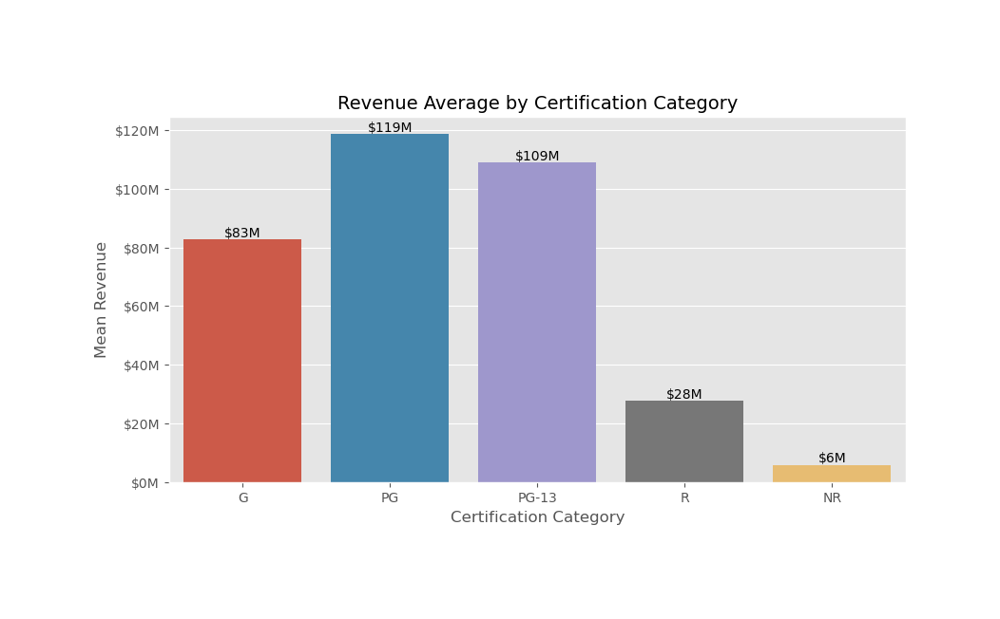
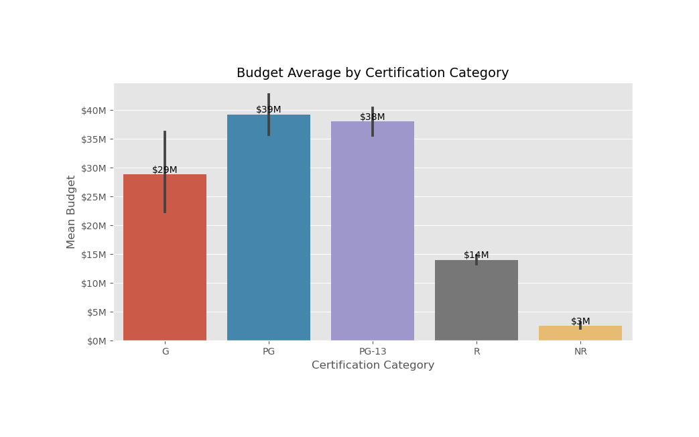
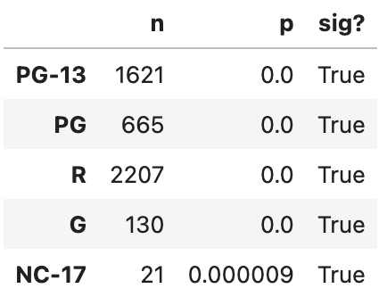
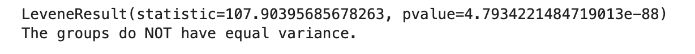
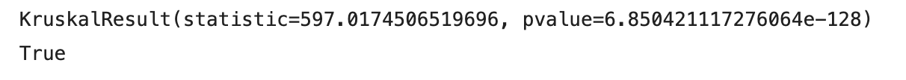
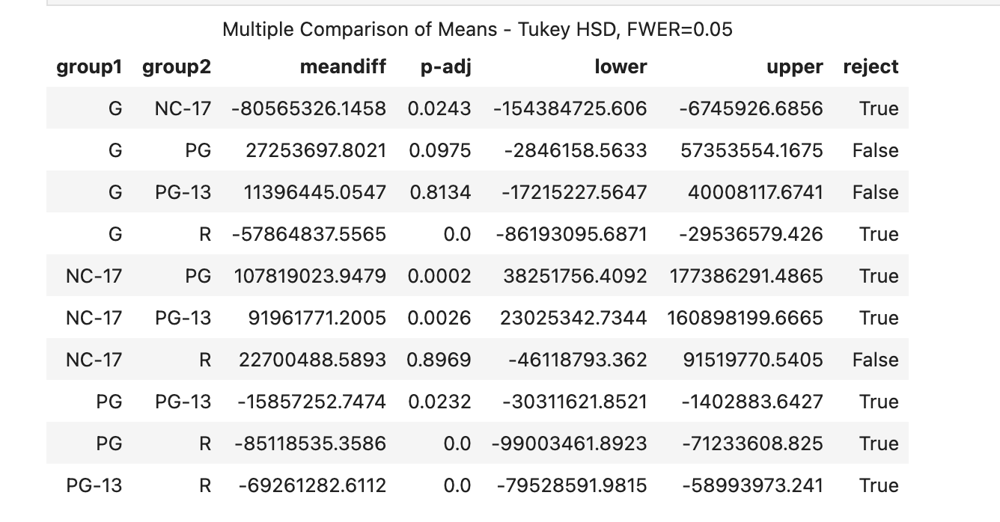

# Movie Analysis and Recommendation

  
  

- API source : [TMDB's API](https://www.themoviedb.org/).  
- Thanks TMDB for free API data

## Business Problem

This project is focused on utilizing data sciece methodologies to process and analyze a comprehensive dataset sourced from IMDB. It is enhanced with financial information retrieved through TMDB's API.The ultimate goal is to perform Extract, Transform, Load (ETL) operations on the raw data and building a MySQL database and export it into a set of CSV files. Leveraging machine learning models and hypothesis testing, goal is to extract valuable insights for stakeholders, providing guidance on strategies for achieving success in the realm of filmmaking with recommendations.

[image source](https://www.istockphoto.com/photo/35mm-film-strip-gm1298343176-391220638?phrase=film/)

## [Data Dictionaries](https://datasets.imdbws.com/)
From IMDB's public datasets following data is downloaded and processed based on stakeholders requirements. Perticularly it includes information about movies and its ratings with some financial information like MPAA rating, genre, budget, revenue etc.
  
### IMDB title.basics.tsv.gz 
- `tconst`: alphanumeric unique identifier of the title
- `titleType`: the type/format of the title (e.g. movie, short, tvseries, tvepisode, video, etc)
- `primaryTitle`: the more popular title / the title used by the filmmakers on promotional materials at the point of release
- `originalTitle`: original title, in the original language
- `isAdult`: 0: non-adult title; 1: adult title
- `startYear (YYYY)`: represents the release year of a title. In the case of TV Series, it is the series start year
- `endYear (YYYY)`: TV Series end year. ‘\N’ for all other title types
- `runtimeMinutes`: primary runtime of the title, in minutes
- `genres`: includes up to three genres associated with the title associated with the title
### IMDB title.ratings.tsv.gz 
- `tconst`: alphanumeric unique identifier of the title
- `averageRating`: weighted average of all the individual user ratings
- `numVotes`: number of votes the title has received

### IMDB title.akas.tsv.gz 
- `titleId`: a tconst, an alphanumeric unique identifier of the title
- `ordering`: a number to uniquely identify rows for a given titleId
- `title`: the localized title
- `region`: the region for this version of the title
- `language`: the language of the title
- `types`: enumerated set of attributes for this alternative title. One or more of the following: "alternative", "dvd", "festival", "tv", "video", "working", "original", "imdbDisplay". New values may be added in the future without warning
- `attributes`: additional terms to describe this alternative title, not enumerated
- `isOriginalTitle`: 0: not original title; 1: original title
### TMDB dictionary
- `imdb_id`: unique identifier used by IMDb
- `adult`: indicates if the content is adult-oriented
- `backdrop_path`: path to the backdrop image
- `belongs_to_collection`: information about the collection the movie belongs to, if any
- `budget`: budget of the movie
- `genres`: genres associated with the movie
- `homepage`: official homepage of the movie
- `id`: unique identifier used by TMDB
- `original_language`: original language of the movie
- `original_title`: original title of the movie
- `overview`: brief summary of the movie
- `popularity`: measure of the movie's popularity
- `poster_path`: path to the poster image
- `production_companies`: production companies involved in the movie
- `production_countries`: countries where the movie was produced
- `release_date`: release date of the movie
- `revenue`: revenue generated by the movie
- `runtime`: runtime of the movie in minutes
- `spoken_languages`: languages spoken in the movie
- `status`: current status of the movie (e.g., Released, Post Production)
## Exploratory Data Analysis
#### Average revenue by Certification

### Average budget by Certification

## Hypothesis Testing

### Does MPAA ratings of movie affect the revenue?

- **`Hypothesis`**
    - ($H_0$) Null Hypothesis : The MPAA rating does not affect its revenue.
    - ($H_A$) Alternative Hypothesis : The MPAA rating of a movie does affect its revenue

- **`Select the right test based on data`**
    - 'revenue' (numeric)
    - 'certification' (categorical)
    - '2 groups'

- **`Test`**
    -  One Way ANOVA and/or Tukey
  
- **`ANOVA Assumptions`**
    - No significant outliers
    - Normality
    - Equal variance
 
- Significance level 0.05

**Outliers** - Removed from both the groups

**Normality Test**

  

- Assumption of Normality failed though, with sufficient samples in each group we can pass the test

**Equal Variance**

  

As we failed the assumtion of equal variance , we will use non parametric Kruskal Wallis instead of one-way ANOVA.

  

**Post-Hoc Tukey Comparisions**

  

**Based on the Tukey's comparision we can conclude that PG moveis make most revenue. NC-17 movies and R rated movies make significantly less as compared to other.**

